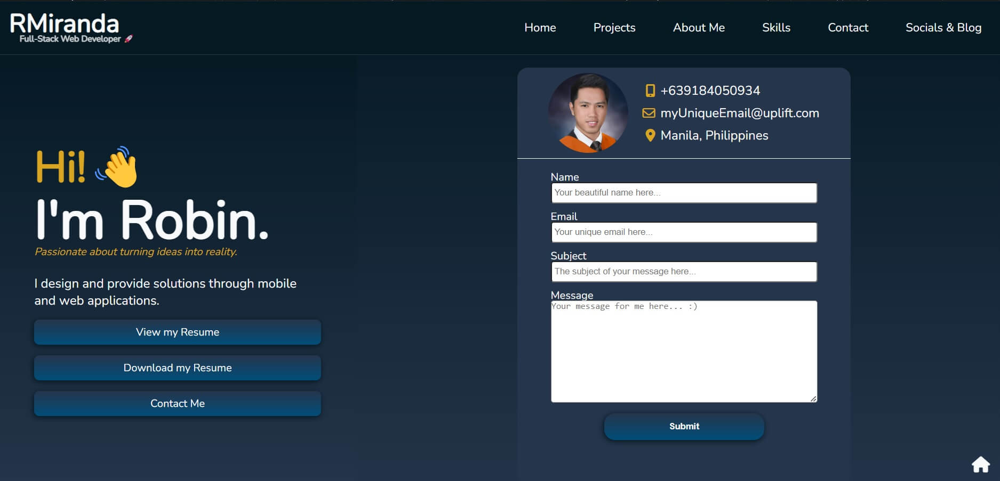

<!-- Improved compatibility of back to top link: See: https://github.com/othneildrew/Best-README-Template/pull/73 -->

<!-- PROJECT LOGO -->
 

<h1 align="center">My First Web Dev Project</h1>

  

    My first web dev project. A web dev portfolio.
     
    <a href="https://23cond.github.io/my-dev-portfolio/" target="_blank" >My First Web Dev Project</a>
  

<!-- ABOUT THE PROJECT -->

## About The Project

This project was created during the early stages of my web development learning
journey. Equipped with newfound knowledge of HTML and CSS, I embarked on this
endeavor to solidify my understanding and put my skills into action. This
project serves as a testament to my dedication and determination to test the
limits of my limited knowledge at the time.

Driven by the desire to create something tangible and meaningful, I challenged
myself to craft a still something visually appealing project. By delving into
the depths of HTML and CSS, I sought to push the boundaries of what I had
learned thus far.

Moreover, this project represents a pivotal moment in my development as a web
developer. It marks the transition from theoretical understanding to practical
application, allowing me to witness firsthand the power and potential of HTML
and CSS to create captivating and immersive experiences.

By undertaking this project early on in my learning journey, I embraced the
challenges and opportunities that came my way, laying the foundation for further
growth and exploration in the vast realm of web development.

### Built With

- HTML5
- CSS3

## License

Distributed under the MIT License. See `LICENSE.txt` for more information.

(<a href="#readme-top">back to top</a>)

