<!-- Improved compatibility of back to top link: See: https://github.com/othneildrew/Best-README-Template/pull/73 -->

<a name="readme-top"></a>

<!-- PROJECT LOGO -->
<br />
<div align="center">
<h3 align="center">MONitime</h3>

  <p align="center">
    A time tracking web app to help you track your time and optimize your life.
    <br />
    <a href="#"><strong>Explore the repo</strong></a>
    <br />
    <br />
    <a href="#">View Demo</a>
  </p>
</div>

<!-- ABOUT THE PROJECT -->

## About The Project

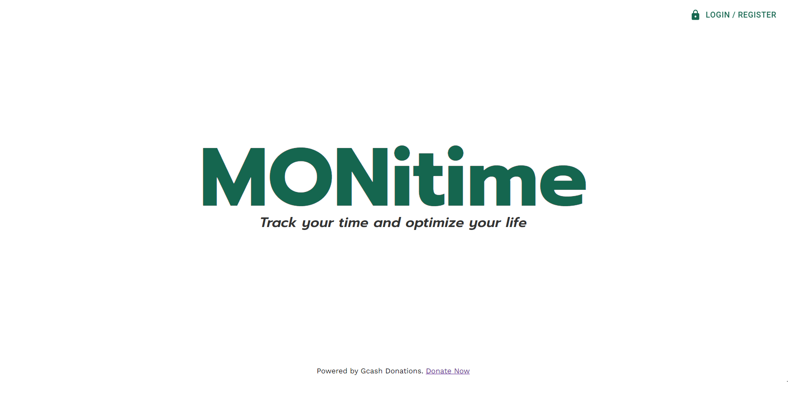

MONitime is a time monitoring app allowing users to track their daily activities
and the time they spend on them. By logging, tracking, analyzing and summarizing
the data, the app help users become more productive and efficient by identifying
areas where they need to adjust their time allocation depending on their
personal goals and target.

### Built With

- [![Modern JS][Modern-JS-badge]][Modern-JS-url]
- [![React.js][React-js-badge]][React-js-url]
- [![MaterialUI][Material-UI-badge]][Material-UI-url]
- [![Node.js][Node-js-badge]][Node-js-url]
- [![Express.js][Express-js-badge]][Express-js-url]
- [![MongoDB][MongoDB-badge]][MongoDB-url]

<!-- GETTING STARTED -->

## Getting Started

To get a local copy up and running follow these simple example steps.

### Prerequisites

Before you begin, make sure you have the following installed on your computer:

Node.js: You can download it from the [official website](https://nodejs.org/).
React.js: You can install it by running `npm install -g create-react-app` in
your terminal. MongoDB: You can download and install it from the official
website.

### Installation

1. Clone the repository to your local machine
   ```sh
   git clone ssdfsfsfsfsdf
   ```
2. Install NPM packages in both the client and server folders
   ```sh
   cd client
   npm install
   cd ../server
   npm install
   ```
3. Start the server by running the following command in the server folder
   ```js
   npm start
   ```
4. Start the client by running the following command in the client folder
   ```js
   npm start
   ```
5. Open your web browser and navigate to http://localhost:3000 to see the
   application running.

<p align="right">(<a href="#readme-top">back to top</a>)</p>

<!-- USAGE EXAMPLES -->

## Usage

### Account Registration and Login

To use the app, a user account is required. Users can register an account and
use their credentials to log in.

### Home Page

On the home page, users can view their records for different dates, provided
they have logged a record for that date.

### Record Page

Clicking the "ADD RECORD" button on the home page will redirect the user to the
record page. Here, the user can add, update, and delete records. The following
buttons are available for record management:

    *ADD/SUBTRACT:* add or subtract a record for the selected date.
    *RESET:* reset all entries of the user for the selected date to zero.
    *DELETE RECORD:* delete all records of the user for the selected date.

### Charts Page

On the charts page, users can view their records logged for different dates to
compare their time allotments.

### Summary Page

On the summary page, users can view calculated summaries depending on the
interval they choose.

### User Menu Options

In the user menu, accessible by clicking the profile image, the following
options are available:

##### Update Profile Info:

    - users can update their profile info, including their name, username, and profile image.

##### Deactivate Account:

    - users can deactivate their account if they no longer wish to use the app.

##### Log Out:

    - users can log out of the app to end their current session.

## Screenshots


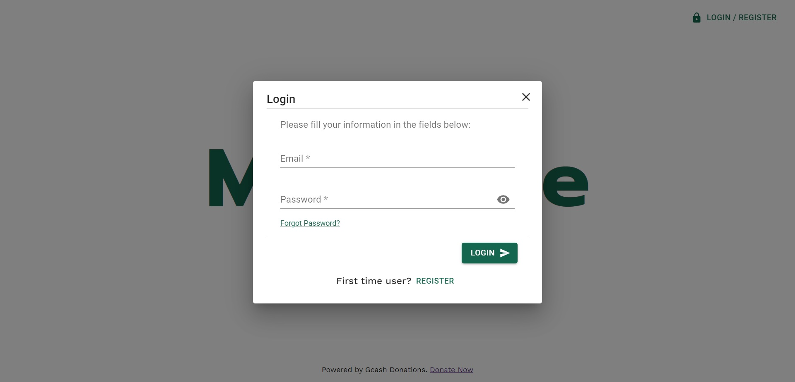
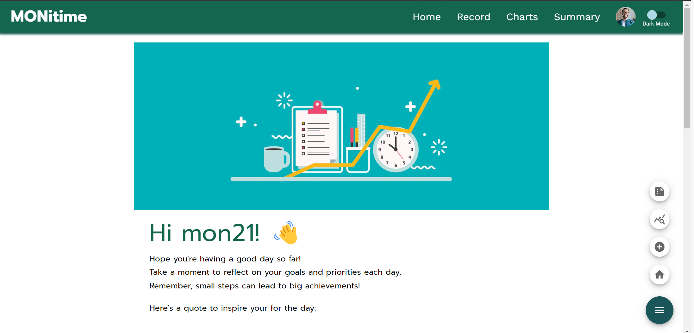
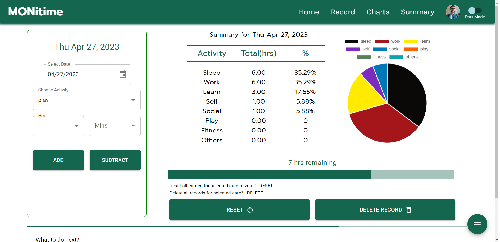
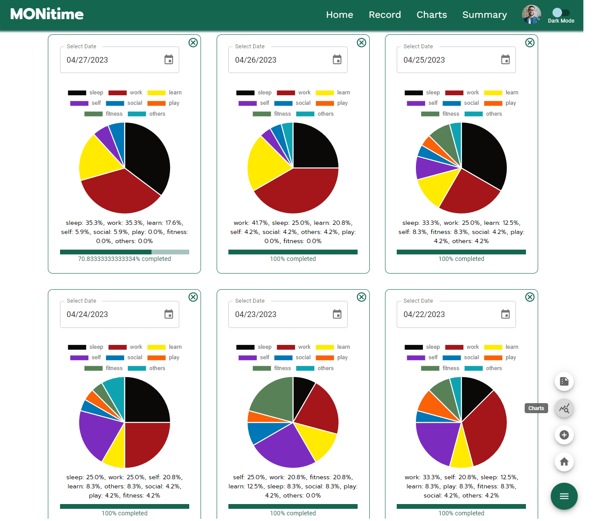
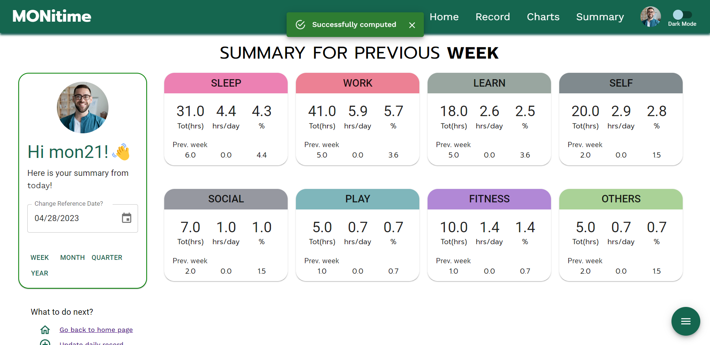
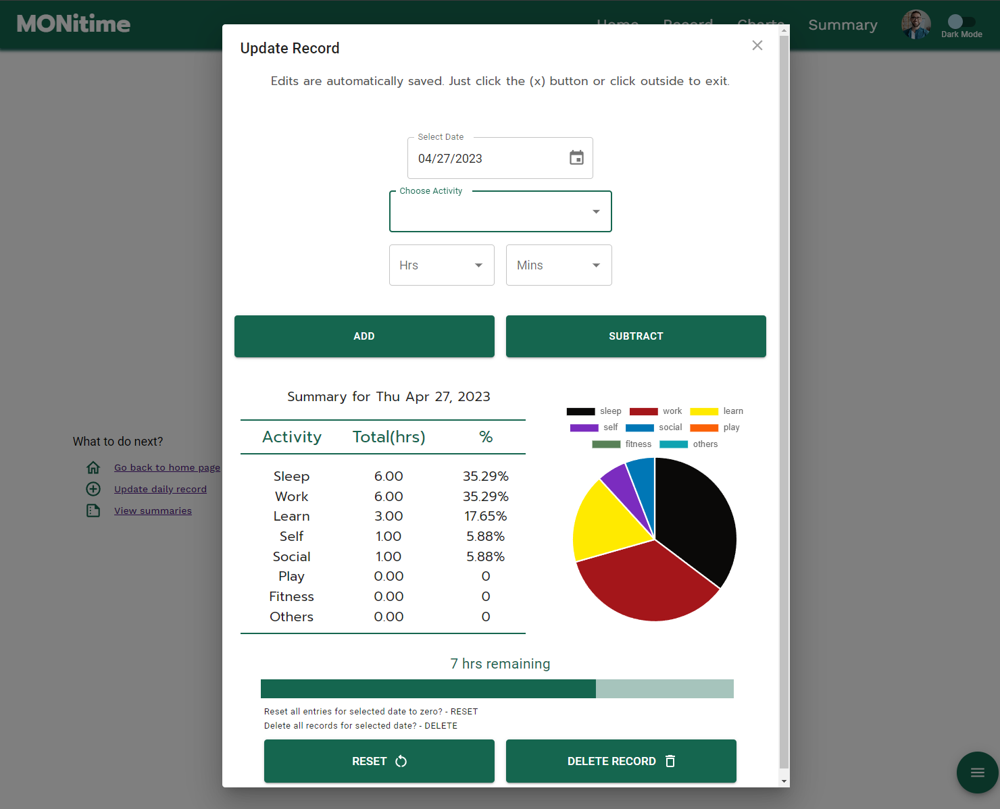
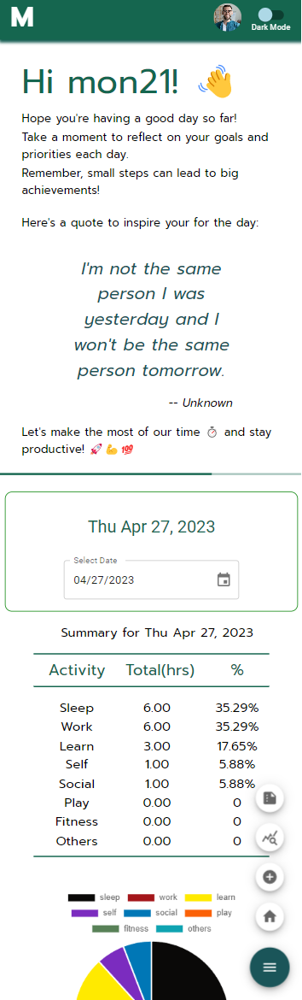
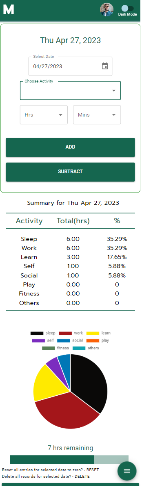
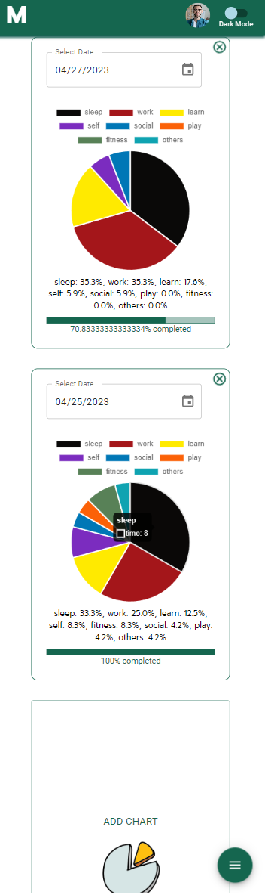
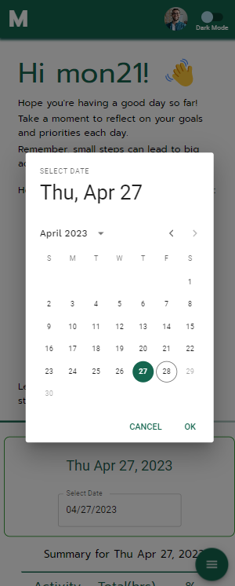
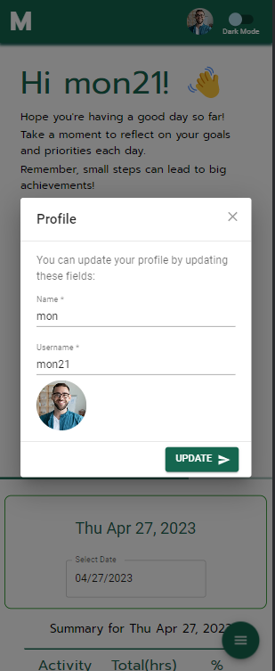
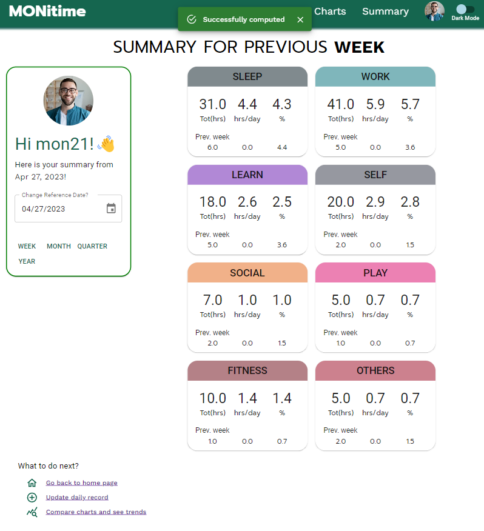
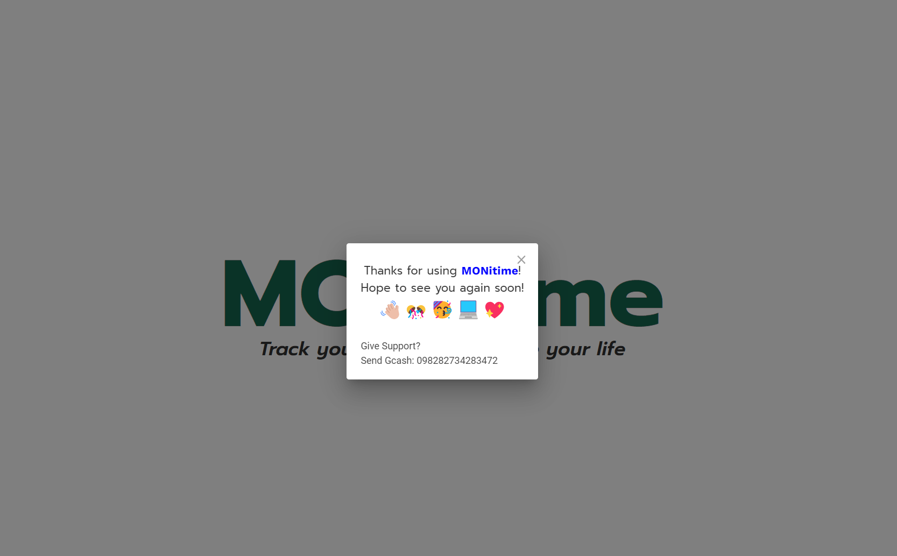

<p align="right">(<a href="#readme-top">back to top</a>)</p>

<!-- ROADMAP -->

## Future Plans

## Known Issues

<p align="right">(<a href="#readme-top">back to top</a>)</p>

<!-- CONTRIBUTING -->

## Contributing

Contributions are what make the open source community such an amazing place to
learn, inspire, and create. Any contributions you make are **greatly
appreciated**.

If you have a suggestion that would make this better, please fork the repo and
create a pull request. You can also simply open an issue with the tag
"enhancement". Don't forget to give the project a star! Thanks again!

1. Fork the Project
2. Create your Feature Branch (`git checkout -b feature/AmazingFeature`)
3. Commit your Changes (`git commit -m 'Add some AmazingFeature'`)
4. Push to the Branch (`git push origin feature/AmazingFeature`)
5. Open a Pull Request

<p align="right">(<a href="#readme-top">back to top</a>)</p>

<!-- LICENSE -->

## License

Distributed under the MIT License. See `LICENSE.txt` for more information.

<p align="right">(<a href="#readme-top">back to top</a>)</p>

<!-- CONTACT -->

## Contact

Your Name - [@twitter_handle](https://twitter.com/twitter_handle) -
email@email_client.com

Project Link:
[https://github.com/github_username/repo_name](https://github.com/github_username/repo_name)

<p align="right">(<a href="#readme-top">back to top</a>)</p>

<!-- ACKNOWLEDGMENTS -->

## Acknowledgments

<p align="right">(<a href="#readme-top">back to top</a>)</p>

<!-- MARKDOWN LINKS & IMAGES -->
<!-- https://www.markdownguide.org/basic-syntax/#reference-style-links -->

[linkedin-shield]:
  https://img.shields.io/badge/-LinkedIn-black.svg?style=for-the-badge&logo=linkedin&colorB=555
[linkedin-url]: https://linkedin.com/in/linkedin_username
[React.js]:
  https://img.shields.io/badge/React-20232A?style=for-the-badge&logo=react&logoColor=61DAFB
[React.js-url]: https://reactjs.org/
[Modern-JS-url]: https://www.modernjs.com/
[React-js-url]: https://reactjs.org/
[Material-UI-url]: https://mui.com/
[Node-js-url]: https://nodejs.org/
[Express-js-url]: https://expressjs.com/
[MongoDB-url]: https://www.mongodb.com/
[Modern-JS-badge]: https://img.shields.io/badge/-Modern%20JS-orange
[React-js-badge]: https://img.shields.io/badge/-React.js-blue
[Material-UI-badge]: https://img.shields.io/badge/-MaterialUI-green
[Node-js-badge]: https://img.shields.io/badge/-Node.js-green
[Express-js-badge]: https://img.shields.io/badge/-Express.js-blue
[MongoDB-badge]: https://img.shields.io/badge/-MongoDB-brightgreen
